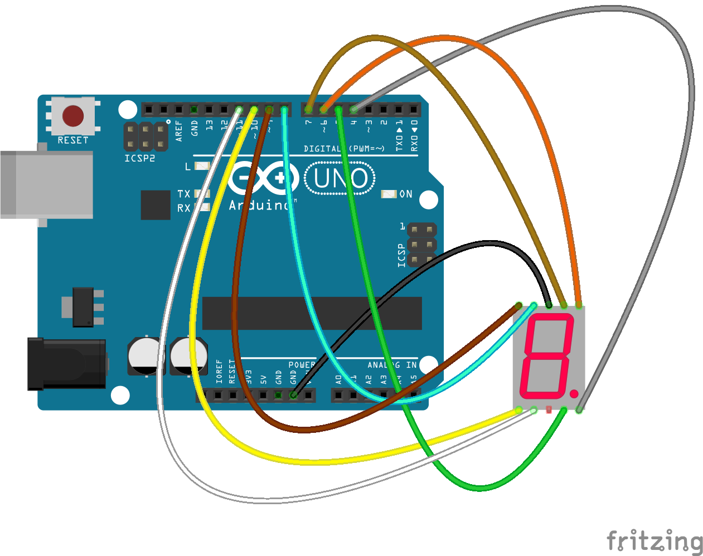

HOW TO USE อย่าลืมต่อ ตัวต้านทาน 220 โอห์ม ด้วยไม่งั้นหลอดไฟขาด
โค้ด start จะรันเลข 0 - 9 ทุกๆ สองวินาที

ในคลิปคือการต่อตาม Cathode (A): พิน เบอร์ 3 หรือ 8 ให้ต่อกับ GND ของ arduino
 

 
จากวงจร circuit ต่อ GND ที่เบอร์ 8 ของหน้าจอ 
และต่อเบอร์ 1 - 10 ของหน้าจอ เข้ากับพินของ arduino คือ 
1 >> 10  
2 >> 11 
3 >> (ว่าง) 
4 >> 5 
5 >> 4 
6 >> 6 
7 >> 7 
8 >> GND 
9 >> 8 
10 >> 9 

  

